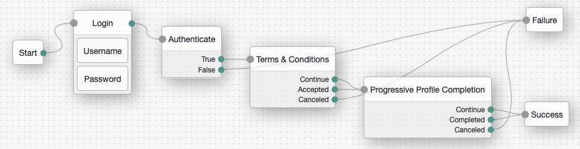
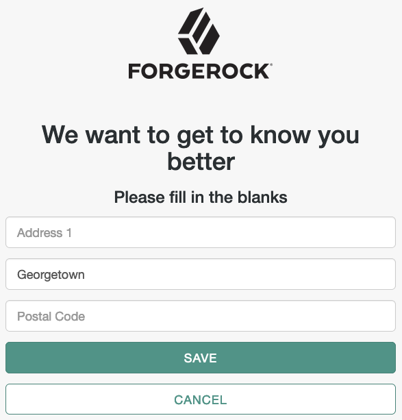

<!--
 * The contents of this file are subject to the terms of the Common Development and
 * Distribution License (the License). You may not use this file except in compliance with the
 * License.
 *
 * You can obtain a copy of the License at legal/CDDLv1.0.txt. See the License for the
 * specific language governing permission and limitations under the License.
 *
 * When distributing Covered Software, include this CDDL Header Notice in each file and include
 * the License file at legal/CDDLv1.0.txt. If applicable, add the following below the CDDL
 * Header, with the fields enclosed by brackets [] replaced by your own identifying
 * information: "Portions copyright [year] [name of copyright owner]".
 *
 * Copyright 2019 ForgeRock AS.
-->
# Progressive Profile Completion Node
ForgeRock Progressive Profile Completion Authentication Tree Node

An authentication node for ForgeRock's [Identity Platform][forgerock_platform] 6.5.2 and above. This node integrates ForgeRock Identity Management's (IDM) progressive profile completion with ForgeRock Access Management's (AM) intelligent authentication framework. Build authentication trees and progressively build out your users' profiles by sporadically asking them for additional information or to confirm existing settings, all based on the Progressive Profile Completion (PPC) settings in IDM.


Download a release build fom the *release* tab or clone this repository to build your own release. Copy the .jar file from your download location or the *./target* directory (if you built it yourself) into the *../web-container/webapps/openam/WEB-INF/lib* directory where AM is deployed.  Restart the web container to pick up the new node.  The node will then appear in the authentication trees components palette.


## Related Nodes
- <a href="https://github.com/vscheuber/TermsAndConditionsNode">Terms And Conditions Node</a>


## Usage
Because user profiles are a personal matter and contain PII data, you should properly authenticate the user in your tree **before** you use this node. Technically, the only thing the node requires besides correct settings (see below) is the *username* shared state variable set (for example by using the Username Collector Node). The node has three exits:
- Continue: None of the PPC rules triggered any forms.
- Completed: One or more of the PPC rules triggered one or more forms and the user did save the forms.
- Canceled: The user decided to cancel out of the process.

A sample tree could look like this:



Note: The user is first properly authenticated using username and password, only then does she reach the PPC node.

A sample dialog you can expect your users to see when they are being prompted for additional information:



## Settings
Setting | Description
------- | -----------
IDM Base URL | Enter the base URL (w/o trailing slash) of the IDM instance you want to use, e.g. https://forgerock.mytestrun.com/openidm
IDM Privileged User | Enter the username of an IDM account privileged to run as another user. See chapter <a href="https://backstage.forgerock.com/docs/idm/6.5/integrators-guide/#auth-run-as">20.1.7. Authenticating as a Different User</a> on how to configure IDM for runAs.
IDM User Password | Enter the password of the IDM account.

## Building Authentication Nodes
The code in this repository has binary dependencies that live in the ForgeRock maven repository. Maven can be configured to authenticate to this repository by following the following [ForgeRock Knowledge Base Article](https://backstage.forgerock.com/knowledge/kb/article/a74096897).
        
```json
{
    "name": "INTERNAL_USER",
    "properties": {
        "queryId": "credential-internaluser-query",
        "queryOnResource": "internal/user",
        "propertyMapping": {
            "authenticationId": "username",
            "userCredential": "password",
            "userRoles": "authzRoles"
        },
        "defaultUserRoles": [],
        "runAsProperties": {
            "adminRoles": [
                "internal/role/openidm-admin"
            ],
            "disallowedRunAsRoles": [],
            "queryOnResource": "managed/user",
            "propertyMapping": {
                "authenticationId": "username",
                "userRoles": "authzRoles"
            }
        }
    },
    "enabled": true
}
```


The code described herein is provided on an "as is" basis, without warranty of any kind, to the fullest extent permitted by law. ForgeRock does not warrant or guarantee the individual success developers may have in implementing the sample code on their development platforms or in production configurations.

ForgeRock does not warrant, guarantee or make any representations regarding the use, results of use, accuracy, timeliness or completeness of any data or information relating to the sample code. ForgeRock disclaims all warranties, expressed or implied, and in particular, disclaims all warranties of merchantability, and warranties related to the code, or any service or software related thereto.

ForgeRock shall not be liable for any direct, indirect or consequential damages or costs of any type arising out of any action taken by you or others related to the sample code.

[forgerock_platform]: https://www.forgerock.com/platform/